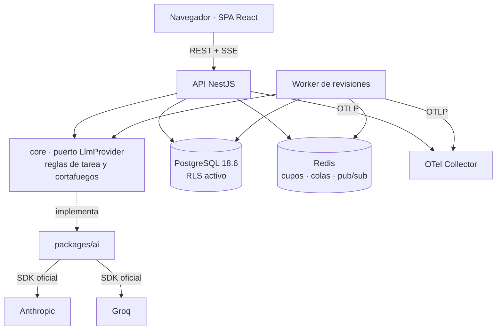

# App Foundry — Documento de Requerimientos Técnicos (v2)

- **Estado:** Borrador para revisión
- **Fecha:** 2026-08-31
- **Autor:** Juan Francisco Martínez Vera (con asistencia de Claude Code)
- **Fase del proceso:** TRD → (siguiente: implementación)
- **Documentos origen:** [REQUIREMENTS-v2.md](./REQUIREMENTS-v2.md) · [TRD.md](./TRD.md) (v1) ·
  [REQUIREMENTS.md](./REQUIREMENTS.md) (v1)

> Extiende el TRD de la v1, no lo sustituye. Las decisiones T-1..T-20 siguen vigentes; las nuevas empiezan en
> **T-21**. Donde este documento no dice nada, manda el de la v1.

---

## 1. Propósito y alcance

Traducir el PRD de la v2 a una arquitectura ejecutable: cómo se habla con dos proveedores de modelos sin
casarse con ninguno, cómo se custodia una credencial ajena, cómo se cuenta lo que se consume sin que el techo
se pueda saltar, y cómo un agente escribe en la base de datos sin ser un usuario y sin poder enzarzarse con
otro agente.

Tres invariantes gobiernan el resto del documento:

1. **Una sola puerta al exterior** (RD-8). Ningún módulo importa un SDK de proveedor: todos pasan por el
   puerto `LlmProvider`.
2. **No hay invocación sin cuenta** (RD-10). La ruta que llama a un modelo sin reservar cupo y sin registrar
   la invocación no existe.
3. **Los agentes no tienen manos** (RD-9). Producen texto; la plataforma decide dónde va. Esto convierte la
   inyección de instrucciones en un problema de calidad, no de seguridad.

---

## 2. Decisiones de arquitectura

| # | Decisión | Alternativas descartadas | Razón |
|---|---|---|---|
| T-21 | **Puerto `LlmProvider` en `packages/core`, adaptadores en `packages/ai`** | Módulo Nest en `apps/api`; todo en un paquete | El dominio declara qué necesita sin conocer la red (RD-1); el MCP de la v3 invoca agentes reutilizando lo mismo que la API en vez de encontrarse la IA encerrada en un módulo HTTP |
| T-22 | **Cuatro operaciones: capacidades, listar modelos, generar texto y generar objeto con esquema** | Solo generar texto y parsear arriba; bucle genérico de herramientas | Las ideas y las revisiones necesitan datos con forma, no prosa. Que el esquema lo garantice el proveedor evita reimplementar la defensa contra JSON torcido en cada caso de uso, y el bucle de herramientas contradice RD-9 y no tiene consumidor |
| T-23 | **SDK oficial de cada proveedor** (`@anthropic-ai/sdk`, `groq-sdk`), uno por adaptador | Capa de abstracción común (Vercel AI SDK); HTTP a mano | Lo específico de cada proveedor está disponible el día que sale, sin esperar a que un tercero lo envuelva; y el contrato que la v3 abre a terceros es el nuestro, no el de una librería (RD-13) |
| T-24 | **Los esquemas del producto se escriben en el subconjunto estricto**: todos los campos obligatorios, `additionalProperties: false`, y lo opcional expresado como unión con `null` | Esquemas libres traducidos por cada adaptador | La decodificación restringida de Groq no admite campos opcionales; escribir en el subconjunto común hace que el mismo esquema valga en los dos y elimina una capa de traducción que fallaría en silencio |
| T-25 | **Búsqueda web y salida con esquema, en dos llamadas** cuando ambas hacen falta: primero investigar, después dar forma | Una sola llamada con herramienta y esquema a la vez | Combinar citas de herramienta de servidor con formato de salida forzado no está garantizado en ninguno de los dos proveedores; separarlo es determinista, funciona igual en ambos y deja la fase cara —la de búsqueda— cacheable e interrumpible |
| T-26 | **Credenciales cifradas en la aplicación con AES-256-GCM**, clave maestra por entorno y versión de clave en cada fila | `pgcrypto`; sobre de dos niveles; KMS externo | La clave nunca viaja dentro de una sentencia SQL (donde acabaría en logs y planes); la versión permite rotar admitiendo dos claves a la vez; y el producto sigue levantándose con un comando en local (RNF-1001) |
| T-27 | **El secreto vive en su propia tabla, sin `SELECT` para el rol de aplicación**, y se lee por una función `SECURITY DEFINER` acotada | Todo en la misma tabla con RLS; permisos por columna | La RLS filtra filas, no columnas (misma lección que T-20). Con tabla aparte y sin permiso directo, la única vía de lectura es una función que no acepta filtros arbitrarios ni devuelve listados (mismo patrón que T-19) |
| T-28 | **El catálogo de modelos se lee de la API de cada proveedor**, se cachea en base de datos y se refresca en segundo plano | Tabla mantenida a mano; fichero de configuración | Ninguno de los dos publica precios, pero los dos publican modelos, ventana de contexto y capacidades: leerlos elimina el catálogo que envejece y hace que RF-1106 dependa de un dato vivo |
| T-29 | **Se mide en tokens, nunca en dinero**, con entrada y salida siempre separadas | Coste estimado con tabla de tarifas | Las tarifas son un dato de terceros que cambia sin avisarnos; un importe calculado con una tabla propia aparenta una precisión que no tenemos. Guardar entrada y salida por separado permite valorar el histórico entero el día que haga falta |
| T-30 | **Contador de cupo en Redis con script Lua, registro de verdad en Postgres**, y reconstrucción del contador desde el registro cuando falta | Contador agregado en Postgres con reserva y liquidación; agregación bajo demanda | El incremento atómico resuelve la carrera sin tocar la base en el camino caliente. El riesgo —que el techo viva en un almacén volátil— se cierra con la persistencia que Redis ya tiene configurada, la reconstrucción desde `ai_invocations` y la conciliación periódica |
| T-31 | **Fallo cerrado**: si no se puede confirmar el cupo, no se invoca | Fallo abierto con registro posterior | Con la cuota de un tercero de por medio, la duda se resuelve a favor del dueño de la clave |
| T-32 | **Revisiones en cola BullMQ sobre el Redis existente**; ideas y asistente en streaming directo | Cola en Postgres con `SKIP LOCKED`; sin cola | Reintentos, espera creciente, concurrencia por proveedor y cancelación resueltos por la librería, sobre una dependencia que ya está (T-6). Solo la revisión dura minutos y escribe: el resto es interactivo y muere con la petición |
| T-33 | **Una revisión escribe todos sus comentarios en una única transacción** que también marca la ejecución como completada | Escritura incremental con marca al final; deduplicación por contenido | Hace la idempotencia estructural: un reintento encuentra la ejecución completada y no repite, y una caída a mitad no deja medio hilo escrito (RNF-703) |
| T-34 | **Autoría polimórfica con dos columnas excluyentes** y restricción del motor; menciones a personas y a agentes en tablas separadas | Tabla `authors` intermedia; comentarios de agente en tabla aparte | El invariante «exactamente un autor» lo garantiza Postgres. Separar las menciones mantiene cada clave ajena obligatoria y refleja que hacen cosas distintas: una notifica, la otra invoca |
| T-35 | **El cortafuegos de agentes se aplica en el filtro de suscripción al evento**, no en el prompt | Instrucciones en el prompt; comprobación en la interfaz | «Un agente no reacciona a otro agente» es `author_id IS NOT NULL` en el consumidor del evento: una condición verificable con un test, no una súplica al modelo |
| T-36 | **Proveedor de mentira que implementa el mismo puerto**, seleccionable por configuración | Interceptar HTTP en los tests; grabar y reproducir | La suite no llama a nadie real (RNF-901) y el recorrido de extremo a extremo puede ejercitar el flujo completo, errores y streaming incluidos, sin consumir la cuota de nadie |

---

## 3. Vista general



El worker es un proceso aparte que comparte código y base de datos con la API. En desarrollo se levanta con
`pnpm dev` junto al resto; en Compose es un servicio más del perfil `app`. Nada de lo que hace requiere estado
local (RD-7).

---

## 4. Cambios en el monorepo

```
packages/
  ai/                        # NUEVO
    src/
      registry.ts            # de ProviderId a adaptador
      anthropic/             # adaptador con @anthropic-ai/sdk
      groq/                  # adaptador con groq-sdk
      fake/                  # proveedor de mentira para tests (T-36)
      errors.ts              # normalización de errores a la taxonomía del puerto
  core/
    src/ai/                  # NUEVO: puerto, tipos, capacidades, tareas,
                             # reglas de disparo y cortafuegos de agentes
      agent-catalog.ts       # las plantillas de fábrica, como datos (RF-1514)
apps/
  worker/                    # NUEVO: consumidor de las colas de IA
```

`packages/ai` depende de `core`; `core` no depende de `ai` ni de ningún SDK. La regla se comprueba en el
linter con la restricción de importaciones que ya existe.

---

## 5. El contrato de proveedor

### 5.1 Capacidades

```ts
type ProviderId = 'ANTHROPIC' | 'GROQ';          // enum extensible (RD-11)

interface ProviderCapabilities {
  streaming: boolean;
  schemaOutput: boolean;      // salida garantizada contra esquema
  webSearch: boolean;         // búsqueda del lado del servidor
  exactTokenCount: boolean;   // ¿cuenta tokens por API o hay que aproximar?
}
```

La interfaz se dibuja a partir de esto (RF-1008). `webSearch: false` no deshabilita la generación de ideas:
la degrada y la avisa (RF-1305). `exactTokenCount: false` obliga a aproximar la entrada al estimar, siempre
al alza (§10).

### 5.2 Operaciones

```ts
interface LlmProvider {
  readonly id: ProviderId;
  readonly capabilities: ProviderCapabilities;

  verify(cred: Credential): Promise<void>;                     // RF-1005
  listModels(cred: Credential): Promise<ModelInfo[]>;          // RF-1007, T-28
  countTokens(req: TextRequest, cred: Credential): Promise<TokenCount>;

  streamText(req: TextRequest, cred: Credential): AsyncIterable<GenerationEvent>;
  streamObject<T>(req: ObjectRequest<T>, cred: Credential): AsyncIterable<GenerationEvent<T>>;
}

interface ModelInfo {
  id: string; displayName: string;
  contextWindow: number; maxOutputTokens: number;
}

type GenerationEvent<T = never> =
  | { type: 'delta'; text: string }
  | { type: 'partial'; value: unknown }          // solo en streamObject
  | { type: 'sources'; sources: WebSource[] }    // solo con búsqueda web
  | { type: 'usage'; usage: TokenUsage }
  | { type: 'done'; value?: T };
```

**Los errores se lanzan, no se emiten.** Un fallo sale del iterador como cualquier otra excepción del
lenguaje, en vez de viajar como un evento más de la secuencia. Un evento de error se puede ignorar sin querer
—basta con no contemplar ese caso en el `switch`— y entonces la operación termina pareciendo un éxito vacío;
una excepción atraviesa el `for await`, se recoge con `try`/`catch` y encaja con la envoltura de reintentos
sin ceremonia. Lo que se lanza es un `ProviderError` con su `kind` de la tabla de abajo.

Toda petición admite una señal de cancelación: cancelar corta la llamada al proveedor, no solo deja de
escuchar (RNF-702). El tipo se declara en `core` con la forma de `AbortSignal` —para que uno real encaje sin
adaptador— pero no lo nombra: el dominio no depende de la biblioteca de ninguna plataforma, y esa es
justamente la restricción que mantiene el puerto reutilizable desde el MCP de la v3.

### 5.3 Taxonomía de errores

Cada adaptador traduce los errores de su SDK a una taxonomía común, porque de ella depende la política de
reintentos (RNF-703):

| `kind` | Reintentable | Ejemplo |
|---|---|---|
| `AUTH` | No | credencial inválida o revocada → el proveedor pasa a `INVALID` (RF-1006) |
| `RATE_LIMIT` | Sí, con espera creciente | 429 del proveedor |
| `TRANSIENT` | Sí | 5xx, corte de conexión, tiempo agotado |
| `CONTEXT_OVERFLOW` | No | no cabía; se rechaza con explicación (RF-1106) |
| `SCHEMA` | Una vez | el modelo no cumplió el esquema pese a la decodificación restringida |
| `CONTENT_FILTER` | No | el proveedor se negó |
| `CANCELLED` | No | lo canceló una persona |
| `MODEL_UNAVAILABLE` | No | el modelo asignado ya no existe en el catálogo (RF-1009) |
| `INVALID_REQUEST` | No | la petición estaba mal formada: error nuestro, no suyo |

Un `AUTH` **nunca** se reintenta: reintentar contra una credencial revocada solo acumula fallos y puede
disparar el bloqueo del proveedor.

La espera de los reintentables crece de forma exponencial y **con azar completo**: se sortea dentro del
intervalo en lugar de esperar siempre lo mismo. Sin ese azar, las cinco invocaciones de una revisión que
tropiezan a la vez reintentan en el mismo instante y vuelven a tumbar al proveedor que estaban esperando a que
se recuperase. Cuando el proveedor dice cuánto esperar, manda él, acotado por el techo de la política.

---

## 6. Los dos adaptadores

Lo que el contrato absorbe, para que arriba nadie se entere:

| | **Anthropic** | **Groq** |
|---|---|---|
| Texto | `messages.stream()` | *chat completions* con `stream: true` |
| Objeto con esquema | `output_config.format` sobre `messages.parse()` | `response_format: { type: 'json_schema' }` con `strict: true` |
| Restricción del esquema | ninguna relevante | decodificación restringida: **todos los campos obligatorios** y `additionalProperties: false` → **T-24** |
| Búsqueda web | herramienta de servidor `web_search_*`, con dominios permitidos o bloqueados y tope de usos | herramientas preconstruidas del lado del servidor |
| Errores de la búsqueda | llegan con **HTTP 200** en un bloque de resultado cuyo contenido es un objeto de error, no una excepción: hay que ramificar antes de iterar | ídem, se normaliza igual |
| Conteo de tokens | endpoint propio → `exactTokenCount: true` | sin endpoint equivalente → aproximación local al alza |
| Catálogo | API de modelos con ventana de contexto, tope de salida y capacidades | listado de modelos con ventana de contexto |

**Asignación por defecto propuesta** al configurar el primer proveedor (RF-1103), editable siempre: el modelo
más capaz disponible para generación de ideas y para agentes —donde la calidad del razonamiento es el
producto— y el más rápido para el asistente de escritura, donde lo que se nota es la latencia y el texto es
corto. Si solo hay un proveedor configurado, todas las tareas van a él.

---

## 7. Modelo de datos

### 7.1 Proveedores, credenciales y catálogo

```
workspace_ai_providers                       -- RF-1001..1006
  id, workspace_id → workspaces
  provider ai_provider NOT NULL              -- ANTHROPIC | GROQ
  status provider_status NOT NULL            -- ACTIVE | DISABLED | INVALID
  credential_hint text NOT NULL              -- últimos caracteres, para reconocerla (RF-1004)
  monthly_token_quota bigint                 -- null = sin cupo (RF-1204)
  quota_alert_pct smallint DEFAULT 80        -- RF-1205
  verified_at, created_by → users
  UNIQUE (workspace_id, provider)

workspace_ai_credentials                     -- T-27: el secreto, aparte
  workspace_id, provider  PRIMARY KEY
  ciphertext bytea NOT NULL, nonce bytea NOT NULL
  key_version int NOT NULL                   -- rotación (T-26)
  -- sin SELECT para el rol de aplicación; se lee por función SECURITY DEFINER

ai_models                                    -- caché del catálogo (T-28)
  provider, model_id  PRIMARY KEY
  display_name text, context_window int, max_output_tokens int
  capabilities jsonb, fetched_at timestamptz, available bool

workspace_task_models                        -- RF-1101, RF-1102
  workspace_id, task ai_task  PRIMARY KEY    -- IDEA_GENERATION | TEXT_ASSIST
  provider, model_id                         -- AGENT_REVIEW | AGENT_REPLY
```

`ai_models` es de instancia, no de workspace: el catálogo de un proveedor es el mismo para todos. Se refresca
con la credencial de cualquier workspace que lo tenga activo, y su contenido no revela nada de nadie.

### 7.2 Agentes

```
agent_templates                              -- RF-1501, RF-1502
  id, workspace_id → workspaces
  name text, handle citext, icon_emoji text, icon_color text
  prompt text NOT NULL
  reply_word_limit int NOT NULL DEFAULT 0    -- 0 = sin límite (RF-1516)
  provider, model_id                         -- null → el de la tarea (RF-1104)
  archived_at, created_by → users
  UNIQUE (workspace_id, handle)

agents                                       -- instancia en una app (RF-1503)
  id, app_id → apps
  template_id → agent_templates ON DELETE SET NULL   -- RF-1505, RF-1509
  name, handle citext, icon_emoji, icon_color
  active bool NOT NULL DEFAULT true          -- RF-1508
  reply_word_limit int NOT NULL DEFAULT 0    -- heredado de la plantilla (RF-1516)
  removed_at timestamptz                     -- retirada lógica (RF-1509)
  added_by → users
  UNIQUE (app_id, handle)                    -- RF-1506, RF-1512

agent_prompt_revisions                       -- RF-1510
  id, agent_id → agents, revision int NOT NULL
  prompt text NOT NULL, created_at, created_by → users
  UNIQUE (agent_id, revision)
```

`reply_word_limit` va en las dos tablas y no solo en la plantilla, por lo mismo que el prompt: la plantilla
propone y la instancia decide. Viaja al **prompt del sistema** —«tu respuesta debe caber en N palabras»— y no
recorta el texto generado: truncar dejaría una frase a medias, que es peor respuesta que una corta. Con cero no
se le dice nada, para no pedir brevedad en nombre de quien no la pidió. El `CHECK (0..5000)` acota el número
escrito por error, no a quien de verdad quiera respuestas largas, y es independiente del techo de tokens de
generación, que es la salvaguarda del sistema (RNF-1003).

El prompt vigente es la revisión de número más alto. Cada comentario guarda **la revisión concreta** con la
que se escribió, no una copia del texto: duplicar kilobytes por línea escrita sería tirar el espacio.

**El catálogo de fábrica no es una tabla** (RF-1514). Los seis perfiles viven en `core/src/ai/agent-catalog.ts`
como datos: nombre, handle sugerido, icono y prompt. No son de nadie, nadie los edita desde la aplicación y
mejoran con el despliegue, así que una tabla solo añadiría filas que mantener sincronizadas con el código.

Adoptar uno **copia** sus campos a una fila de `agent_templates` y ahí se acaba el vínculo: no se guarda de qué
entrada del catálogo salió. Es deliberado. Guardarlo invitaría a la pregunta «tu plantilla de origen cambió,
¿la adoptas?» que RF-1505 sí plantea entre plantilla e instancia, y ahí no tendría el mismo sentido: entre dos
filas del workspace el cambio lo hizo alguien conocido, mientras que un catálogo que cambia solo al desplegar
estaría proponiéndole al dueño adoptar una decisión nuestra sobre un texto que él ya hizo suyo.

Una consecuencia que conviene ver escrita: como adoptar es **crear una plantilla**, lo hace el `OWNER` y nadie
más (RF-1502, RF-1514). Un miembro con permiso de edición en una app puede añadirle agentes, pero solo a partir
de plantillas que ya existan en el workspace. Un workspace recién creado necesita, por tanto, un gesto de su
dueño antes de que ninguna app pueda tener agentes; a cambio, `agents.template_id` sigue apuntando siempre a
una fila y no hace falta una segunda relación polimórfica para saber de dónde desciende un agente.

### 7.3 Comentarios: autoría polimórfica

```
comments
  author_id → users           NULL  (antes NOT NULL)
  author_agent_id → agents    NULL                        -- T-34
  agent_prompt_revision_id → agent_prompt_revisions NULL  -- RF-1510
  CHECK (num_nonnulls(author_id, author_agent_id) = 1)
  CHECK (author_agent_id IS NULL) = (agent_prompt_revision_id IS NULL)

comment_threads
  created_by → users          NULL  (antes NOT NULL)
  created_by_agent_id → agents NULL
  CHECK (num_nonnulls(created_by, created_by_agent_id) = 1)

comment_agent_mentions                       -- RF-1602.1: invoca
  comment_id → comments, agent_id → agents, PRIMARY KEY (comment_id, agent_id)
```

`comment_mentions` (a personas) no cambia: sigue notificando. Son dos tablas porque son dos comportamientos.

**Migración.** Las columnas pasan a admitir nulo *después* de que las filas existentes tengan valor, así que
no hay ventana en la que un comentario pueda quedarse sin autor. Las restricciones se añaden como `NOT VALID`
y se validan a continuación, para no bloquear la tabla mientras se comprueba.

### 7.4 Invocaciones y revisiones

```
ai_invocations                               -- RF-1201, RD-10
  id, workspace_id, app_id
  actor_user_id → users, actor_agent_id → agents   -- quién la provocó
  task ai_task, provider, model_id
  input_tokens int, output_tokens int          -- separados siempre (T-29)
  ttft_ms int, latency_ms int
  outcome ai_outcome                           -- COMPLETED | FAILED | CANCELLED | QUOTA_BLOCKED
  error_kind text, review_run_id
  INDEX (workspace_id, created_at DESC)
  INDEX (workspace_id, provider, created_at)   -- reconstrucción del contador (§9.3)

agent_reviews                                -- RF-1606..1610
  id, app_id, requested_by → users
  version_id → document_versions               -- la versión revisada (RF-1607, D-35)
  status review_status                         -- QUEUED | RUNNING | DONE | CANCELLED | FAILED
  estimated_tokens bigint, started_at, finished_at
  UNIQUE INDEX (app_id) WHERE status IN ('QUEUED','RUNNING')   -- RF-1609 en el motor

agent_review_runs
  id, review_id → agent_reviews, agent_id → agents
  status, threads_written int, idempotency_key text UNIQUE      -- T-33
```

Ese índice único parcial es lo que hace imposible una segunda revisión simultánea: no depende de que el
código se acuerde de comprobarlo.

`ai_invocations` **no guarda contenido**: ni el prompt, ni el documento, ni la respuesta (RF-1202, RNF-112).

---

## 8. Seguridad

### 8.1 La credencial

- **Cifrado**: AES-256-GCM en la aplicación. Clave maestra de instancia por entorno (`AI_CREDENTIAL_KEYS`,
  que admite varias versiones a la vez), nunca en el repositorio (RNF-106, RNF-601).
- **Datos autenticados**: el cifrado se ata a `workspace_id` y `provider`. Copiar una fila a otro workspace la
  vuelve indescifrable, en vez de regalarle la clave a quien la copió.
- **Rotación**: cada fila guarda `key_version`. Se admite una clave nueva para cifrar y las viejas solo para
  descifrar, y un comando recifra en lote:

  ```bash
  AI_CREDENTIAL_KEYS=1:vieja,2:nueva pnpm --filter @app-foundry/api ai:rotate
  ```

  Va con el **rol de migraciones** y no con el de la aplicación, por dos motivos que conviene tener juntos:
  necesita leer el texto cifrado, vedado al rol de la aplicación por permiso de columna; y corre sin ninguna
  persona detrás, así que la función acotada —que exige pertenencia al workspace— no le sirve. Es la única vía
  deliberadamente distinta, y por eso es un comando y no un endpoint. Admite `--dry-run`, escribe todo en una
  transacción, y **informa** de las credenciales ilegibles en lugar de abortar: detener el lote por una
  dejaría a los demás workspaces a medias. Termina con error si hubo alguna, que es la señal de que todavía no
  se puede retirar la clave vieja. Perder todas las claves no es recuperable: la credencial se marca como
  ilegible y se pide al dueño que la vuelva a introducir, en vez de que la aplicación falle en cada
  invocación.
- **Lectura**: sin `SELECT` sobre la tabla para el rol de aplicación, y `SELECT` **por columna** sobre lo que
  no es secreto (T-27, misma técnica que T-20). Esa mitad no es adorno: sin poder leer `workspace_id` y
  `provider` el rol no podría ni actualizar su propia fila, porque un `UPDATE ... WHERE` exige leer las
  columnas del filtro. La única vía al cifrado es una función `SECURITY DEFINER` con `search_path` fijo que
  recibe un par concreto, no acepta filtros arbitrarios y no devuelve listados. Además exige dos cosas: que
  **haya una persona detrás** —quien pide el secreto ha de ser miembro de ese workspace, y el trabajo en
  segundo plano corre con la identidad de quien lo provocó— y que el proveedor esté **activo**, de modo que
  uno desactivado no se pueda usar ni por descuido.
- **Salida**: ningún DTO expone la credencial. El único dato que viaja al cliente es `credential_hint`
  (RF-1004). Los mensajes de error del proveedor se normalizan antes de reenviarse: nunca se propaga tal cual
  un cuerpo que pueda contener la clave (RNF-602).

### 8.2 Aislamiento

Todas las tablas nuevas con `workspace_id` llevan política RLS con el mismo patrón que la v1 (§6 del TRD v1).
Las de la app (`agents`, `agent_prompt_revisions`, `agent_reviews`) se acotan **a través de `apps`**, igual
que los comentarios. `ai_models` es la única sin `workspace_id`: legible por cualquier sesión autenticada,
porque no contiene datos de nadie.

Las políticas nuevas entran en la suite de aislamiento existente, ejecutada con el rol de aplicación y no como
superusuario (RNF-904), incluido el caso negativo que importa: **un miembro que no es dueño no puede leer la
credencial de su propio workspace**.

### 8.3 Qué se envía a un tercero

`RNF-604` se implementa en un solo sitio: el constructor de la petición recibe el contexto del usuario que la
provoca y arma el contenido con las mismas consultas que la interfaz, sujetas a RLS. No hay un camino
privilegiado que lea el documento «para la IA».

### 8.4 Inyección de instrucciones

El perfil del agente va en el mensaje de sistema; el documento y los comentarios, en mensajes de usuario
claramente delimitados y etiquetados como material a comentar (RF-1614). La garantía real, sin embargo, no es
esa separación sino RD-9: un agente sin herramientas y sin permisos solo puede producir un comentario. El
peor caso de una inyección es un comentario malo que cualquiera puede borrar.

---

## 9. Consumo y cupos

### 9.1 Dónde vive cada cosa

- **La verdad** es `ai_invocations` en Postgres: una fila por invocación, con sus tokens.
- **El contador** es una clave de Redis por `(workspace, proveedor, mes UTC)`, con dos campos: `spent` y
  `reserved`. Es una **caché derivable**, no la fuente.

### 9.2 Reserva y liquidación

1. Antes de invocar se estima un **techo** de tokens (§10) y se reserva con un script Lua atómico:
   si `spent + reserved + estimado > cupo`, devuelve rechazo y no se llama a nadie; si cabe, incrementa
   `reserved` y devuelve un identificador de reserva.
2. Se invoca. El evento `usage` del proveedor trae los tokens reales.
3. Se liquida: `reserved -= estimado`, `spent += real`, y se escribe la fila en `ai_invocations`.

El script Lua es lo que resuelve la carrera: cinco agentes lanzados a la vez se serializan dentro de Redis,
sin que la aplicación tenga que coordinarse.

**Reservas huérfanas.** Cada reserva se apunta con su vencimiento; un barrido periódico libera las que
caducaron sin liquidar. Sin esto, una caída entre los pasos 1 y 3 dejaría cupo comido para siempre.

### 9.3 Cuando Redis no sabe

- **Clave ausente** (reinicio sin fichero, vaciado, instancia nueva): se reconstruye agregando
  `ai_invocations` de ese mes y proveedor, y se siembra con escritura condicional para que dos procesos
  simultáneos no la reconstruyan dos veces. Es una consulta por índice sobre un mes de datos.
- **Redis no responde**: no se invoca (T-31). Con la cuota de un tercero de por medio, la duda se resuelve a
  favor del dueño de la clave.
- **Deriva**: si un proceso muere entre la llamada y la liquidación, el gasto queda en Postgres pero no en el
  contador. Una **conciliación diaria** recalcula el contador del mes en curso desde el registro. Es la única
  operación que hace de la elección de Redis una decisión segura y no una apuesta.

El mes se cuenta en UTC, y así se dice en la interfaz.

### 9.4 Límite por miembro

`RF-1206` se resuelve con el mismo mecanismo de rate limiting que ya usa la v1 sobre Redis, con clave por
`(workspace, usuario, ventana)`. Es un límite de invocaciones, no de tokens: acota el ritmo, no el volumen,
y son cosas distintas que conviene no mezclar.

---

## 10. Estimación previa

`RF-1207` pide una cifra antes de haber llamado a nadie, y la cifra tiene que ser un **techo**: enseñar una
media y luego pasarse sería peor que no enseñar nada.

- **Entrada**: se cuenta de verdad. Con `exactTokenCount: true` se usa el contador del proveedor; si no, una
  aproximación local, siempre redondeada al alza y con margen. La aproximación se calibra contra el contador
  exacto en los tests, para que el margen sea un número justificado y no un número bonito.
- **Salida**: el máximo de tokens que el producto permite generar en esa tarea, que es un valor de
  configuración y no una predicción.
- **Revisión completa**: la suma sobre los agentes activos.

Lo que se enseña es «como mucho N tokens», y la liquidación posterior registra los reales. La brecha entre
ambos es una métrica: si el techo resulta ser cinco veces lo real, el tope de salida por tarea está mal
puesto.

---

## 11. Ejecución

### 11.1 Interactivo

Generación de ideas (RF-1306) y asistente de escritura (RF-1407) van por SSE desde su endpoint, con el flujo
del proveedor reenviado tal cual. Si el cliente se va, el `AbortSignal` corta la llamada al proveedor y la
invocación se registra como `CANCELLED` con los tokens consumidos hasta ese punto.

### 11.2 En cola

Revisiones y respuestas de agente van a dos colas BullMQ: `ai-review` y `ai-agent-reply`. Ambas son
asíncronas por naturaleza —nadie espera mirando a que un agente conteste a una mención—.

Los nombres llevan guion y no dos puntos, que es como estaban escritos aquí hasta que se arrancó el worker:
BullMQ compone sus claves de Redis con `:` y rechaza en el arranque cualquier cola que lo lleve en el nombre.

- **Concurrencia**: limitada globalmente y **por proveedor**, para que una revisión de cinco agentes no agote
  el límite de tasa del proveedor y tumbe de paso al asistente de escritura de otro workspace (RNF-705).
- **Reintentos**: solo para `TRANSIENT` y `RATE_LIMIT`, con espera creciente y tope. El resto no se reintenta.
- **Idempotencia**: cada ejecución `(revisión, agente)` tiene su clave, y **escribe todos sus hilos y su
  cambio de estado en una sola transacción** (T-33). Un reintento que encuentra la ejecución completada no
  repite nada.
- **Cancelación**: bandera en Redis que el worker consulta entre agentes, más `AbortSignal` para la llamada en
  curso. Lo ya escrito se queda; lo pendiente no arranca (RF-1610).
- **Progreso**: cada cambio de estado se publica en el canal Redis que ya alimenta el SSE (T-6), así que la
  interfaz ve avanzar la revisión sin sondear.
- **Cortacircuitos**: fallos consecutivos por proveedor contados en Redis. Abierto, las funciones que dependen
  de ese proveedor responden «el proveedor no responde» en vez de fallar de forma genérica (RNF-704).

---

## 12. Los tres casos de uso, extremo a extremo

### 12.1 Generación de ideas

1. El usuario rellena restricciones (RF-1302); ninguna es obligatoria.
2. Si el modelo asignado tiene búsqueda web, **primera llamada**: investigar el dominio con la herramienta de
   servidor y devolver hallazgos con sus fuentes. **Segunda llamada**: dar forma a las propuestas contra el
   esquema, citando esas fuentes (T-25). Si no la tiene, se salta la primera y se marca el resultado como no
   fundamentado (RF-1305).
3. El esquema es una lista de tres a cinco propuestas con los campos de RF-1303, en el subconjunto estricto
   (T-24). Los parciales del streaming pintan las fichas conforme llegan.
4. Pedir otra tanda reenvía las restricciones más los títulos ya vistos como exclusiones (RF-1307).
5. Al elegir, una transacción crea la app, su documento y **la copia de trabajo** con la visión sembrada sobre
   la plantilla de la v1, sin versión (RF-1308). El nivel de acceso y el precursor salen de las reglas de la
   v1 sin excepción (RF-1310).

### 12.2 Asistente de escritura

1. El alcance es la **selección** o el **documento entero** (RF-1411). En ambos casos el texto se toma del
   fuente, no del render.
2. Se envía el alcance más el documento como contexto si cabe; si no, solo su entorno (RF-1409).
3. La respuesta llega en streaming y se pinta como diff contra el texto original, reutilizando el mismo
   componente que compara versiones.
4. Aceptar aplica el cambio a la copia de trabajo con la **misma comprobación de concurrencia** que un
   guardado (RF-1408, RF-511): si la copia cambió mientras se generaba, se rechaza y se ofrece ver qué cambió.
   No crea versión (RF-1405).

#### 12.2.1 El menú de selección: tres arreglos de la v1

El asistente cuelga del menú que hoy sirve para comentar, y ese menú arrastra tres defectos que hay que
corregir antes (RF-1414..1416). Los tres viven en `apps/web`, entre
[selection-menu.tsx](../apps/web/src/components/selection-menu.tsx),
[selection.ts](../apps/web/src/lib/selection.ts) y el manejador de la ficha.

| Defecto | Causa | Arreglo |
|---|---|---|
| El menú aparece lejos del texto, o encima | Se posiciona con `clientX`/`clientY` del `mouseup`: al arrastrar deprisa el puntero va por delante del texto, y al arrastrar de derecha a izquierda el gesto termina en el **inicio** de la selección | Posicionar con `range.getClientRects()`: se toma el **último** rectángulo —el final visual de la selección—, y el menú va bajo su borde inferior alineado a su derecha. Si no cabe abajo, arriba; y siempre replegado dentro de la ventana |
| Doble clic, triple clic, teclado y arrastres que terminan fuera del texto no abren el menú | El disparador es `onMouseUp` del contenedor: no cubre la selección por teclado, y el orden entre la selección del navegador y ese evento no está garantizado en el doble clic | Escuchar `selectionchange` del documento, con un fotograma de espera para no recalcular en cada píxel del arrastre, y comprobar que la selección cae dentro del contenedor de lectura |
| Seleccionar un título o un párrafo completo no ofrece nada | `resolveSelection` busca el rastro `data-src-start` subiendo desde `commonAncestorContainer`; cuando la selección cubre el bloque entero, ese contenedor pasa a ser el **padre**, que no lo lleva | Resolver el bloque subiendo desde `range.startContainer` y desde `endContainer`, y exigir que ambos den el mismo bloque. Nada que ver con el markdown: el rastro está puesto en títulos, párrafos, elementos de lista y citas |

Un cuarto detalle de la misma revisión: el mínimo de tres caracteres para considerar una selección deja fuera
el doble clic sobre palabras cortas. Baja a dos, que es donde el anclaje por cita más contexto (§9 del TRD v1)
sigue siendo capaz de desambiguar.

Estos arreglos entran en **H10** con el asistente, y llevan prueba de extremo a extremo propia: seleccionar
con doble clic, con arrastre de derecha a izquierda y sobre un título tiene que ofrecer el menú en los tres
casos, y el menú tiene que caer bajo la selección.

### 12.3 Agentes

**Disparo** (RF-1602). Tres entradas, y el filtro está en el consumidor del evento, no en el prompt (T-35):

| Situación | Condición exacta |
|---|---|
| Mención | comentario con `author_id IS NOT NULL` que menciona al agente |
| Revisión | petición explícita, sobre la versión actual |
| Réplica | comentario con `author_id IS NOT NULL` en un hilo donde el agente ya escribió |

**Cortafuegos** (RF-1604, RF-1605), todos comprobables con una consulta:

- Un evento cuyo autor es un agente no dispara a nadie: `author_id IS NOT NULL` es la condición de entrada.
- Las menciones escritas por un agente no se insertan en `comment_agent_mentions` ni en `comment_mentions`.
- Turnos: `count(*) FROM comments WHERE thread_id = ? AND author_agent_id = ?` contra el tope de instancia.

**Revisión** (RF-1606, RF-1607). El agente recibe el contenido de la **versión actual** y devuelve, contra
esquema, una lista de `{ cita, comentario }` más una valoración general. Cada cita se ancla con el mismo
mecanismo que un comentario inline humano —cita, prefijo, sufijo y posición en el fuente de esa versión
(§9 del TRD v1)—. Una cita que no aparece literalmente en el documento **se descarta** y se cuenta como
métrica: preferimos perder un comentario a colgarlo del fragmento equivocado, que es la misma decisión que
tomó la v1 con el reanclaje (D-13).

**Contexto entregado**: perfil del agente (mensaje de sistema), metadatos de la app, contenido de la versión,
y —en respuestas— el hilo en el que participa. Nunca otras apps, nunca otros workspaces.

---

## 13. API

Rutas nuevas, todas bajo el mismo esquema de sesión y CSRF de la v1:

| Método y ruta | Quién | Qué |
|---|---|---|
| `GET/PUT/DELETE /workspaces/:id/ai/providers/:provider` | `OWNER` | Configurar proveedor y credencial |
| `POST /workspaces/:id/ai/providers/:provider/verify` | `OWNER` | Validación contra el proveedor (RF-1005) |
| `PUT /workspaces/:id/ai/providers/:provider/quota` | `OWNER` | Cupo mensual de tokens |
| `GET /workspaces/:id/ai/models` | `OWNER` | Catálogo cacheado |
| `GET/PUT /workspaces/:id/ai/tasks` | `OWNER` | Asignación de modelo por tarea |
| `GET /workspaces/:id/ai/usage` | miembro *(el suyo)* / `OWNER` *(todo)* | Consumo del mes |
| `POST /workspaces/:id/ai/ideas` | miembro | Generación de ideas (SSE) |
| `POST /apps/:id/document/assist` | edición | Propuesta sobre la selección (SSE) |
| `GET /workspaces/:id/agent-templates/catalog` | `OWNER` | Catálogo de fábrica, y cuáles chocan de handle |
| `GET/POST/PATCH/DELETE /workspaces/:id/agent-templates/...` | `OWNER` | Plantillas, propias o adoptadas |
| `GET/POST/PATCH/DELETE /apps/:id/agents/...` | edición | Agentes de la app |
| `POST /apps/:id/reviews/estimate` | lectura | Techo de tokens y confirmación |
| `POST /apps/:id/reviews` | lectura | Lanzar revisión |
| `DELETE /apps/:id/reviews/:rid` | lectura *(quien la pidió)* / precursor | Cancelar |

El contrato OpenAPI y el cliente tipado se regeneran como en la v1 (T-8), así que el MCP de la v3 hereda todo
esto sin trabajo adicional.

---

## 14. Frontend

- **Panel de creación** (home del workspace): junto al campo que ya existe, la vía de ideas. Las fichas se
  pintan desde los parciales del streaming; elegir una navega al editor de la app recién creada.
- **Editor**: el menú de selección que hoy ofrece comentar gana las acciones de IA, con el posicionamiento y
  la detección arreglados (§12.2.1). Las mismas acciones están en los controles del editor para el documento
  entero, con su techo de tokens a la vista (RF-1412). La propuesta se muestra como diff, con aceptar y
  descartar.
- **Ficha de la app**: sección de agentes con icono, perfil y estado; botón de revisión con su estimación y su
  progreso.
- **Comentarios**: los de agente llevan distintivo propio además del icono (RF-1611), que es lo que distingue
  quién ha escrito (RF-1613). La cabecera del panel se queda en tres controles: sin resolver, resueltos y
  plegar.
- **Ajustes del workspace**: proveedores, asignación por tarea, cupos y consumo.

Todo lo relativo a IA se monta en **rutas y componentes con carga diferida**, y no se descarga siquiera cuando
el workspace no tiene proveedor (RF-1010).

---

## 15. Observabilidad

Cada invocación abre un *span* hijo de la petición o del trabajo que la originó, con proveedor, modelo, tarea,
tokens de entrada y salida, latencia hasta la primera palabra, latencia total y desenlace. **Nunca contenido**
(RNF-801, T-17).

Métricas nuevas: invocaciones por proveedor, modelo y tarea; tokens de entrada y de salida; consumo frente al
cupo; errores por `kind`; latencia en percentiles; profundidad y espera de las colas; estado del
cortacircuitos; brecha entre techo estimado y consumo real; comentarios de agente descartados por cita no
encontrada.

Panel de Grafana propio para la IA, junto a los de la v1. El agotamiento de un cupo y la apertura de un
cortacircuitos se emiten como eventos, no solo como mensaje en pantalla (RNF-804).

---

## 16. Pruebas

| Suite | Qué cubre |
|---|---|
| Proveedor de mentira | Implementa el puerto con respuestas deterministas, streaming simulado, cada `kind` de error y conteos de tokens fijos (T-36, RNF-901) |
| Adaptadores | Traducción de errores a la taxonomía, esquema estricto, parseo del bloque de error de la búsqueda web que llega con HTTP 200 |
| Cortafuegos | Un agente no reacciona a otro; una mención de agente no invoca ni notifica; el tope de turnos se respeta (RNF-902) |
| Cupos | Reserva y liquidación concurrentes; reconstrucción con la clave ausente; fallo cerrado sin Redis; conciliación (RNF-903) |
| Aislamiento | Tablas nuevas con el rol de aplicación, incluido que un miembro no lee la credencial (RNF-904) |
| Extremo a extremo | Configurar proveedor falso → ideas → crear app → mejorar párrafo → revisión con comentarios (RNF-905) |

La suite completa sigue corriendo en CI sin credenciales de ningún proveedor. Un adaptador real solo se
ejercita a mano, con clave propia, y nunca en CI:

```bash
ANTHROPIC_API_KEY=... pnpm --filter @app-foundry/ai smoke anthropic
```

La prueba de humo recorre las cuatro operaciones del puerto contra la API de verdad —verificar, catálogo,
conteo, texto y objeto con esquema— y gasta unos pocos cientos de tokens. Es donde se comprueba que lo escrito
contra la documentación se comporta como dice cuando hay alguien al otro lado.

---

## 17. Rendimiento y escalabilidad

- **El camino caliente no crece.** Reservar cupo es una operación de Redis; registrar la invocación, una
  inserción. Consultar el consumo del mes es leer una clave, no agregar una tabla.
- **Las colas absorben los picos.** La concurrencia por proveedor es el único límite real, y es un número de
  configuración.
- **El worker escala aparte de la API.** Un pico de revisiones no degrada la navegación, porque no comparten
  proceso.
- **El catálogo no se pide al pintar.** Se refresca en segundo plano y se sirve de la base de datos.
- **El frontend no engorda.** La IA entra por carga diferida y no se descarga sin proveedor configurado.

---

## 18. Riesgos

| Riesgo | Impacto | Mitigación |
|---|---|---|
| El contador de cupo vive en un almacén volátil | Alto | Persistencia ya activa en el Redis del Compose; reconstrucción desde `ai_invocations`; conciliación diaria; fallo cerrado (§9.3) |
| Combinar búsqueda web y salida con esquema en una sola llamada no está garantizado | Medio | Dos llamadas por diseño (T-25), que además funcionan igual en los dos proveedores |
| Una credencial ajena filtrada es gasto directo en la cuenta de otro | Alto | Cifrado con datos autenticados, tabla aparte sin `SELECT`, normalización de errores del proveedor, y ausencia total en logs y auditoría (§8.1) |
| El techo estimado asusta por muy superior al consumo real | Bajo | Métrica de la brecha; el tope de salida por tarea se ajusta con datos, no por intuición |
| Un agente inunda un documento de comentarios | Medio | Tope de agentes por app, tope de turnos por hilo, sin disparo automático al commitear, y descarte de citas no encontradas |
| Deriva entre el catálogo y lo que el proveedor ofrece de verdad | Bajo | Refresco en segundo plano, último catálogo conocido si no responde, aviso al dueño si el modelo asignado desaparece |
| `packages/ai` se convierte en el sitio donde se cuela lógica de negocio | Medio | Regla explícita: los adaptadores traducen y nada más; las reglas de tarea, de disparo y de cortafuegos viven en `core` |
| Un reintento duplica los comentarios de una revisión | Alto | Escritura y cambio de estado en la misma transacción, con clave de idempotencia (T-33) |

---

## 19. Trazabilidad

| Requisito | Dónde se resuelve |
|---|---|
| RF-1001..1012 proveedores | §5, §6, §7.1, §8.1 |
| RF-1101..1107 tareas y modelos | §6, §7.1, §13 |
| RF-1201..1210 consumo y cupos | §7.4, §9, §10 |
| RF-1301..1312 ideas | §12.1 |
| RF-1401..1416 asistente y menú de selección | §12.2, §12.2.1 |
| RF-1501..1516 agentes, catálogo de fábrica y límite de respuesta | §7.2, §13, §14 |
| RF-1615 aviso cuando un agente no puede contestar | §7.2, §11.2 |
| RF-1601..1614 conversación de agentes | §12.3, §8.4 |
| RF-1701..1705 transparencia y auditoría | §7.4, §14, §15 |
| RNF-601..607 seguridad | §8 |
| RNF-701..707 rendimiento y resiliencia | §11, §17 |
| RNF-801..804 observabilidad | §15 |
| RNF-901..905 calidad | §16 |
| RNF-1001..1003 operación | §4, §16, §20 |
| RD-8..RD-13 | §2, §4, §8.4, §9 |

---

## 20. Plan de implementación

| Hito | Contenido | Deja usable |
|---|---|---|
| **H9** | Puerto y adaptadores, cifrado de credenciales, catálogo por API, asignación por tarea, registro de invocaciones, cupos y consumo | Nada visible aún, pero la IA ya tiene grifo y contador |
| **H10** | Arreglo del menú de selección; asistente de escritura sobre selección y sobre documento entero, diff, aceptar y descartar | **Primer valor real, y el más usado** |
| **H11** | Generación de ideas, con y sin búsqueda web, y creación de la app con visión sembrada | Cierra el flujo desde «no tengo ideas» |
| **H12** | Agentes: modelo de datos, plantillas, instancias, autoría polimórfica, menciones y respuesta a mención | Conversar con un interlocutor con perfil |
| **H13** | Revisión en abanico: cola, worker, estimación, confirmación, cancelación y cortafuegos | **Pensar acompañado, completo** |
| **H14** | Panel de Grafana, recorrido de extremo a extremo, conciliación de cupos, cierre | v2 completa |

**Por qué este orden.** H9 no entrega nada visible, pero sin él cualquier función de IA nace sin contador y
sin techo, y añadírselo después es reescribirla (RD-10). H10 va antes que H11 aunque parezca menor: es la
función que se usa cada día, la más barata de construir sobre H9 y la que valida el contrato con tráfico real
antes de que lleguen los agentes. Los agentes se parten en dos hitos porque la mitad difícil no es el modelo
de datos sino el abanico: cola, idempotencia, cancelación y cortafuegos.

---

## 21. Preguntas abiertas

Ninguna de diseño. Las ocho que abrió el PRD están resueltas y recogidas en T-21..T-36.

Dos cosas hay que **verificar contra el proveedor al empezar H9**, no porque estén sin decidir, sino porque
dependen de comportamiento que solo se confirma ejecutándolo:

- Que combinar herramienta de búsqueda del lado del servidor con salida forzada contra esquema en una misma
  llamada falla o degrada como esperamos. El diseño ya no depende de ello (T-25), pero si funcionara sin
  problemas nos ahorraría una llamada por generación de ideas.
- El margen real de la aproximación local de tokens de Groq frente al contador exacto de Anthropic sobre
  documentos representativos, para fijar el factor de seguridad de §10 con datos y no a ojo.

El TRD queda cerrado. Lo siguiente es **H9**.
