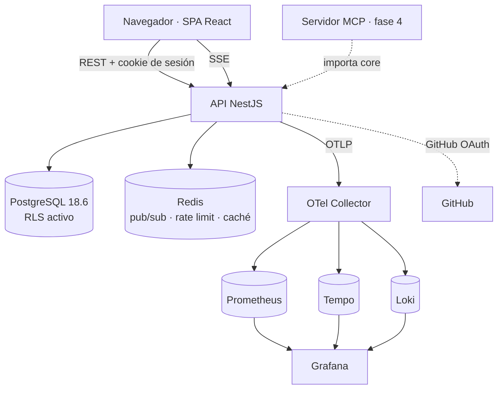

# App Foundry — Documento de Requerimientos Técnicos (v1)

- **Estado:** Borrador para revisión
- **Fecha:** 2026-08-28
- **Documento origen:** [REQUIREMENTS.md](./REQUIREMENTS.md) — v1, 105 RF + 23 RNF
- **Fase del proceso:** Requerimientos ✅ → **TRD** → Implementación

---

## 1. Propósito y alcance

Este documento define **cómo** se construye la v1 descrita en `REQUIREMENTS.md`. No reabre decisiones de
producto: cuando una decisión técnica existe por un requisito, se cita (`RF-xxx`, `RNF-xxx`, `RD-x`).

Dimensionado de partida (RNF-201): decenas de usuarios y cientos de apps. Ninguna elección se justifica por
volúmenes que no vamos a tener. Cuando algo se diseña pensando en el futuro, es por **escalabilidad estructural**
—que plugins (fase 2), integraciones (fase 3), MCP (fase 4) y SaaS (fase 6) no obliguen a reescribir— y no por
carga.

---

## 2. Decisiones de arquitectura

| # | Decisión | Alternativas descartadas | Razón |
|---|---|---|---|
| T-1 | **Monorepo TypeScript**: API NestJS + SPA React/Vite + paquete `core` de dominio | Next.js full-stack; FastAPI + React | Los módulos y providers de Nest encajan con el runtime de plugins de la fase 2; separar API y SPA mantiene fronteras nítidas y facilita el trazado |
| T-2 | **PostgreSQL 18.6 con Row-Level Security** en todas las tablas de negocio | RLS parcial; aislamiento solo en repositorio; SQLite | RD-6 y RNF-103: el aislamiento entre workspaces lo garantiza el motor, no la disciplina del programador |
| T-3 | **Drizzle ORM** | Prisma; Kysely; SQL a mano | SQL-first y tipado, convive con RLS y con SQL crudo (búsqueda full-text); sin motor de consultas intermedio |
| T-4 | **OpenTelemetry** con stack Grafana (Prometheus + Tempo + Loki) en Compose | Sentry; solo Jaeger; solo logs | Trazas, métricas y logs correlacionados desde el día uno, con backend intercambiable |
| T-5 | **Passport (`passport-oauth2`) + sesión opaca en base de datos** | `passport-github2`; arctic; JWT + refresh | Integración estándar en Nest; la sesión en BD es lo único que cumple RF-110. Se usa la estrategia genérica apuntada a GitHub porque `passport-github2` lleva sin publicarse desde 2022 y es la puerta de entrada al producto |
| T-6 | **SSE + Redis** para notificaciones, pub/sub, rate limiting y caché de sesión | Polling; WebSocket; SSE sin Redis | SSE es unidireccional y sobre HTTP normal, con reconexión nativa; Redis permite escalar a varias instancias sin romper el canal (RNF-109) |
| T-7 | **CodeMirror 6 sobre markdown crudo**, render con remark/rehype, anclaje por cita con reanclaje difuso | TipTap/ProseMirror; comentarios por bloque | RF-502 y RF-512 exigen que el markdown sea la fuente de verdad, no una exportación con pérdidas |
| T-8 | **REST + OpenAPI generado**, cliente TS derivado del contrato | tRPC; GraphQL | El contrato debe ser consumible por el MCP (fase 4) y por plugins externos (fase 2), no solo por un cliente TypeScript |
| T-9 | **Tailwind + shadcn/ui** | Mantine; MUI; componentes propios | Componentes Radix accesibles (RNF-501) que se copian al repositorio y se modifican: identidad visual propia sin reimplementar diálogos ni menús |
| T-10 | **Búsqueda full-text nativa de Postgres** (`tsvector` + GIN) | Meilisearch/Typesense; pg_trgm | Sobra para el dimensionado y, sobre todo, hereda RLS: la búsqueda no puede devolver lo que no puedes ver |
| T-11 | **pnpm workspaces + Turborepo** | Solo pnpm; Nx | Caché de tareas y paralelismo con configuración mínima |
| T-12 | **UUIDv7** generado por Postgres con la función nativa `uuidv7()` de PG18 | Enteros secuenciales; UUIDv4; generación en la aplicación | Ordenables temporalmente (buena localidad en índices B-tree) y no adivinables (RNF-110); al ser nativo de PG18 no hace falta extensión ni librería |
| T-13 | **Versiones con contenido completo**, no diffs incrementales | Cadena de diffs | Un documento de visión son kilobytes; restaurar y comparar se vuelven operaciones triviales y sin riesgo de corrupción de cadena |
| T-14 | **TanStack Query** para el estado de servidor en la SPA | Redux; Zustand + fetch a mano | Caché, revalidación y estados de carga resueltos; el estado local propio es mínimo |
| T-15 | **PostgreSQL 18.6**, fijada por versión exacta en Compose y en CI | Rama flotante `18`; PG 17 | Última estable (rama de septiembre de 2025, soporte hasta noviembre de 2030); fijarla evita que una actualización de imagen cambie el comportamiento bajo los pies |
| T-16 | **GitHub Actions desde H0** | CI más adelante; solo scripts locales | Las garantías que valen son las que corren solas; la suite de aislamiento (§14) pierde sentido si depende de que alguien la ejecute |
| T-17 | **Sin datos sensibles en auditoría ni en telemetría** (RF-706, RNF-112) | Registrar IP y contexto completo | La auditoría dice qué pasó, no qué decía; sin alertas de seguridad en v1, guardar IPs es riesgo sin contrapartida |
| T-18 | **`VISION.md` exportado con front-matter YAML** (RF-512) | Solo el contenido | Un documento exportado debe ser identificable fuera de la plataforma, y el front-matter no estorba a ningún lector de markdown |
| T-19 | El login lee `users` a través de una función **`SECURITY DEFINER` acotada** | Rol `app_auth` aparte; política que permita leer sin contexto | Superficie mínima y auditable: no acepta filtros arbitrarios ni devuelve listados. Abrir la tabla cuando no hay identidad convertiría cualquier consulta sin contexto en una fuga |
| T-20 | Los campos de perfil se protegen con **`GRANT UPDATE` por columna**, no solo con RLS | Trigger de validación; política adicional | RLS filtra filas, no columnas: sin esto un usuario puede modificar su propia fila entera y ascenderse a `ADMIN`. El permiso por columna lo impide en el motor |

---

## 3. Vista general del sistema



Todo lo que no es la aplicación corre en `docker compose`. En desarrollo, API y SPA corren en local con
`pnpm dev` contra esa infraestructura (RNF-301).

---

## 4. Estructura del monorepo

```
app-foundry/
├── apps/
│   ├── api/                 # NestJS: HTTP, auth, RLS, SSE, OpenAPI
│   │   └── src/modules/     # auth, users, workspaces, apps, documents,
│   │                        # comments, notifications, search, audit, admin
│   ├── web/                 # React + Vite + Tailwind + shadcn/ui
│   └── mcp/                 # fase 4 · placeholder que ya importa @foundry/core
├── packages/
│   ├── core/                # dominio puro: entidades, reglas de permisos,
│   │                        # casos de uso, eventos. Sin HTTP, sin SQL.
│   ├── db/                  # esquema Drizzle, migraciones, políticas RLS
│   ├── contracts/           # OpenAPI generado + cliente tipado
│   └── config/              # tsconfig, eslint y prettier compartidos
├── infra/
│   ├── docker-compose.yml   # postgres, redis, otel-collector, tempo, loki,
│   │                        # prometheus, grafana
│   └── observability/       # configuración de cada componente
└── docs/                    # REQUIREMENTS.md, TRD.md
```

**Sobre `core` (RD-1).** Contiene lo que el servidor MCP tendrá que reutilizar literalmente: entidades, las
funciones puras de autorización (`canEditApp`, `canComment`, `canChangeAccessLevel`…), los casos de uso y los
eventos de dominio. El acceso a datos entra por **puertos** (interfaces) que implementa `apps/api` con Drizzle.

> **Riesgo a vigilar:** hexagonal mal aplicado degenera en una interfaz por cada consulta. `core` debe quedarse
> en reglas de negocio y casos de uso. Si un puerto no aporta más que reenviar a Drizzle, no debe existir.

---

## 5. Modelo de datos

Todas las tablas llevan `id uuid` (UUIDv7, T-12), `created_at timestamptz not null default now()` y, donde
aplica, `updated_at`. Los enums son tipos nativos de Postgres.

### 5.1 Identidad

```
users
  id, github_id bigint UNIQUE NOT NULL      -- identidad real de la cuenta (RF-104)
  handle citext UNIQUE NOT NULL             -- username de GitHub (RF-208)
  email citext NOT NULL
  display_name, avatar_url
  platform_role  platform_role  NOT NULL DEFAULT 'MEMBER'   -- ADMIN | MEMBER
  status         user_status    NOT NULL DEFAULT 'ACTIVE'   -- ACTIVE | DEACTIVATED
  last_login_at

sessions                                     -- RF-107, RF-110
  id, user_id → users
  token_hash bytea NOT NULL                  -- SHA-256 del token; nunca el token en claro
  expires_at, last_seen_at, user_agent
  ip_prefix inet                             -- IP truncada (/24 y /48): sirve para
                                             -- reconocer una sesión, no para rastrear
  INDEX (user_id), INDEX (expires_at)
```

`github_id` es la clave de identidad: el username y el email pueden cambiar en GitHub sin dejar de ser la
misma persona, y se refrescan en cada login (RF-104, RF-208).

### 5.2 Workspaces

```
workspaces
  id, owner_id → users, name, slug citext
  is_personal boolean NOT NULL DEFAULT true  -- RD-5: el workspace de equipo es este mismo modelo

workspace_members
  workspace_id → workspaces, user_id → users
  role workspace_role NOT NULL               -- OWNER | MEMBER
  PRIMARY KEY (workspace_id, user_id)

workspace_invitations                        -- RF-304..306
  id, workspace_id → workspaces, email citext NOT NULL, invited_by → users
  status invitation_status NOT NULL          -- PENDING | ACCEPTED | REVOKED | EXPIRED
  expires_at
  UNIQUE (workspace_id, email) WHERE status = 'PENDING'
```

### 5.3 Apps y documentos

```
apps
  id, workspace_id → workspaces, slug citext, name, short_description
  status      app_status   NOT NULL DEFAULT 'IDEA'
  access_level access_level NOT NULL DEFAULT 'PRIVATE'
  precursor_id → users NOT NULL              -- RF-401, transferible RF-409
  icon_emoji text NOT NULL, icon_color text NOT NULL   -- RF-415, RF-416
  repo_url text                              -- RF-417, opcional e informativo
  archived_at timestamptz                    -- RF-410
  search_tsv tsvector                        -- mantenido por trigger, §10
  UNIQUE (workspace_id, slug)                -- RF-412
  INDEX GIN (search_tsv)
  INDEX (workspace_id, updated_at DESC)      -- listado por defecto, RF-603

app_tags
  app_id → apps, tag citext, PRIMARY KEY (app_id, tag)
  INDEX (tag)

documents                                    -- RF-514: preparado para PRD y TRD
  id, app_id → apps, type document_type NOT NULL   -- VISION | PRD | TRD
  current_version_id → document_versions     -- HEAD: la última versión commiteada
  current_content text NOT NULL              -- copia de trabajo, compartida (RF-505)
  revision int NOT NULL DEFAULT 0            -- +1 en cada guardado, commit o descarte
  UNIQUE (app_id, type)

document_working_authors                     -- quién ha guardado desde el último commit
  document_id → documents, user_id → users, PRIMARY KEY (document_id, user_id)

document_versions                            -- RF-505, inmutables
  id, document_id → documents, version_no int NOT NULL
  content text NOT NULL                      -- contenido completo (T-13)
  author_id → users, message text            -- mensaje obligatorio, ≤ 100 (RF-505)
  UNIQUE (document_id, version_no)
  INDEX (document_id, created_at DESC)

document_version_coauthors                   -- RF-516
  version_id → document_versions, user_id → users, PRIMARY KEY (version_id, user_id)
```

`documents.current_content` **no** es una copia de la versión actual: es la copia de trabajo, y puede ir por
delante de `current_version_id`. Que vaya por delante —que haya cambios sin commitear— se sabe comparándola
con el contenido de esa versión, sin más estado que mantener sincronizado.

`revision` es lo que protege de ediciones concurrentes (RF-511): el editor manda la revisión que leyó y el
guardado se rechaza si ya no es esa. `current_version_id` no sirve para eso desde que dos guardados seguidos
comparten versión.

`document_working_authors` se vacía en cada commit y en cada descarte. Al commitear, quienes queden ahí y no
sean el autor pasan a `document_version_coauthors`: sin eso, quien escribe y no commitea desaparecería del
historial de autoría.

**Contribuidores (RF-509)** no es una tabla: se derivan de los autores y coautores de las versiones,
excluyendo al precursor.

### 5.4 Comentarios

```
comment_threads                              -- RF-801, RF-802
  id, app_id → apps, document_id → documents
  kind   thread_kind  NOT NULL               -- GENERAL | INLINE
  status thread_status NOT NULL DEFAULT 'OPEN'   -- OPEN | RESOLVED
  -- anclaje inline (§9); null en hilos generales, que son de la app (RF-801)
  anchor_quote text, anchor_prefix text, anchor_suffix text
  anchor_start int, anchor_end int           -- posición en SU versión: inmutable (RF-808)
  anchored_version_id → document_versions    -- a qué versión pertenece el hilo (RF-817)
  anchor_status anchor_status                -- ANCHORED | ORPHANED (RF-809)
  -- posición sobre la copia de trabajo, recalculada en cada guardado (§9.3)
  working_start int, working_end int, working_status anchor_status
  created_by → users
  resolved_by → users, resolved_at, reopened_by → users, reopened_at   -- RF-807
  INDEX (app_id, status)

comments
  id, thread_id → comment_threads, parent_id → comments  -- un solo nivel (RF-804)
  body text NOT NULL, author_id → users
  edited_at, deleted_at                      -- borrado lógico: preserva el hilo (RF-806)
  CHECK (parent_id IS NULL OR (SELECT parent_id FROM comments p WHERE p.id = parent_id) IS NULL)

comment_mentions                             -- RF-814
  comment_id → comments, user_id → users, PRIMARY KEY (comment_id, user_id)
```

El `CHECK` se implementa como trigger (Postgres no permite subconsultas en `CHECK`); su función es impedir
anidamiento de más de un nivel a nivel de datos, no solo de UI.

### 5.5 Notificaciones y auditoría

```
notifications                                -- RF-901..911
  id, user_id → users, type notification_type NOT NULL
  payload jsonb NOT NULL                     -- datos para renderizar sin joins
  workspace_id, app_id, thread_id            -- para revocar acceso y navegar (RF-904, RF-906)
  read_at
  INDEX (user_id, created_at DESC) WHERE read_at IS NULL
  INDEX (created_at)                         -- purga (RF-910)

audit_log                                    -- RF-701..705
  id, actor_id → users, action text NOT NULL
  resource_type text, resource_id uuid, workspace_id uuid
  metadata jsonb
  INDEX (workspace_id, created_at DESC), INDEX (actor_id, created_at DESC)
```

`audit_log` no tiene `UPDATE` ni `DELETE` concedidos al rol de aplicación (RF-705): la garantía es de permisos
de Postgres, no de código.

**Datos sensibles fuera (RF-706, RNF-112, T-17).** `metadata` guarda identificadores y valores de enum —qué
nivel de acceso se cambió, a qué rol se promovió—, **nunca** contenido: ni el texto de un documento, ni el de
un comentario, ni tokens, ni direcciones IP. La misma regla se aplica a logs, trazas y métricas (§13). El
nombre de una app puede aparecer en `metadata` porque sin él una entrada de borrado sería inútil; el contenido
de sus documentos, jamás.

---

## 6. Seguridad: aislamiento por workspace

Es el invariante más importante del sistema (RNF-103, RD-6). Se implementa en tres capas, cada una capaz de
detener un fallo de la anterior.

### 6.1 Capa 1 — Row-Level Security

La aplicación se conecta con un rol `app_user` **sin** `BYPASSRLS` y **sin** `SUPERUSER`. Las migraciones usan
un rol distinto y privilegiado. Toda tabla de negocio lleva `ENABLE ROW LEVEL SECURITY` y `FORCE ROW LEVEL
SECURITY`.

```sql
CREATE FUNCTION current_app_user() RETURNS uuid
  LANGUAGE sql STABLE AS $$ SELECT nullif(current_setting('app.user_id', true), '')::uuid $$;

-- SECURITY DEFINER para romper la recursión: la política de una tabla no puede
-- consultarla a través de otra política sobre sí misma.
CREATE FUNCTION user_workspaces(uid uuid) RETURNS SETOF uuid
  LANGUAGE sql STABLE SECURITY DEFINER AS $$
    SELECT workspace_id FROM workspace_members WHERE user_id = uid $$;

CREATE POLICY apps_visible ON apps FOR SELECT USING (
  workspace_id IN (SELECT user_workspaces(current_app_user()))
  AND (access_level <> 'PRIVATE' OR precursor_id = current_app_user())
);
```

La política de `apps` codifica literalmente la tabla 3.6 de requisitos: pertenencia al workspace **y**, si la
app es privada, ser su precursor. Las tablas dependientes (`documents`, `document_versions`,
`comment_threads`, `comments`) heredan la visibilidad mediante `EXISTS` sobre `apps`, de modo que la regla
vive en un solo sitio.

**Advertencia registrada:** `SECURITY DEFINER` es potente y peligroso. `user_workspaces` no acepta más entrada
que un uuid, no concatena SQL y tiene `search_path` fijado explícitamente.

### 6.2 Capa 2 — Contexto de petición

Un interceptor de Nest abre la transacción, fija la identidad y la guarda en **AsyncLocalStorage**:

```ts
await db.transaction(async (tx) => {
  await tx.execute(sql`SELECT set_config('app.user_id', ${userId}, true)`);
  return als.run({ tx, userId }, () => next());
});
```

`set_config(..., true)` es **local a la transacción**: al terminar, el contexto desaparece, así que una
conexión reutilizada del pool nunca arrastra la identidad de otro usuario. Los repositorios toman `tx` del
AsyncLocalStorage y nunca del pool global.

> Se descarta el uso de providers *request-scoped* de Nest: reinstancian el árbol de dependencias en cada
> petición y penalizan latencia y memoria sin aportar nada aquí.

### 6.3 Capa 3 — Reglas explícitas de dominio

`packages/core` expone funciones puras de autorización que la API invoca antes de actuar. RLS impide *leer* lo
que no toca; estas funciones deciden si una *acción* está permitida, que no es lo mismo: cambiar el nivel de
acceso solo puede hacerlo el precursor que además es dueño del workspace (RF-406), y eso no se expresa como
filtro de filas.

### 6.4 Resto de medidas

| Requisito | Implementación |
|---|---|
| RNF-104 (CSRF) | Cookie `SameSite=Lax` + token CSRF de doble envío en operaciones de escritura |
| RNF-105 (OAuth) | `state` firmado y de un solo uso en Redis, con expiración corta |
| RNF-106 (secretos) | Solo variables de entorno; `.env.example` sin valores reales |
| RNF-107 (entradas) | `class-validator` en los DTO; Drizzle parametriza siempre |
| RNF-109 (rate limit) | `@nestjs/throttler` con almacenamiento en Redis, más estricto en login e invitaciones |
| RNF-111 (scopes) | Solo `read:user` y `user:email`. Ningún permiso sobre repositorios en v1 |
| RF-513 (XSS) | `rehype-sanitize` con lista blanca; nunca `dangerouslySetInnerHTML` sobre HTML sin sanear |

---

## 7. Autenticación y sesión

> **Acceso a `users` durante el login (T-19).** El login busca por `github_id` antes de que exista identidad,
> y la política de `users` solo deja a cada uno verse a sí mismo. Se resuelve con una función
> `SECURITY DEFINER` de superficie mínima —recibe un `github_id`, devuelve solo los campos que la
> autenticación necesita— en lugar de abrir la tabla. No acepta filtros arbitrarios ni devuelve listados, así
> que no sirve para enumerar usuarios aunque alguien la invoque.

1. `GET /auth/github` → redirección a GitHub con `state` de un solo uso.
2. `GET /auth/github/callback` → Passport valida, y en una transacción:
   - se busca por `github_id`; si no existe, se crea el usuario, **su workspace personal** (RF-105) y se
     aplican las invitaciones pendientes para su email (RF-106);
   - si existe, se refrescan `handle`, `email`, `display_name` y `avatar_url`;
   - se rechaza si `status = 'DEACTIVATED'` (RF-110);
   - se emite sesión: token aleatorio de 256 bits, se guarda su SHA-256, se envía en cookie `HttpOnly`,
     `Secure`, `SameSite=Lax`.
3. Cada petición: se busca la sesión por hash (cacheada en Redis con TTL corto), se comprueba vigencia y que el
   usuario siga activo, y se refresca `last_seen_at` de forma perezosa.
4. Desactivar a un usuario borra sus sesiones y su entrada de caché: el acceso cae de inmediato (RF-110).

El primer `ADMIN` se designa con `BOOTSTRAP_ADMIN_GITHUB_LOGIN` y se aplica en su alta (RF-111).

---

## 8. API

REST sobre `/api/v1`, OpenAPI generado desde los DTO con `@nestjs/swagger`, y cliente TypeScript generado a
`packages/contracts` en tiempo de build (T-8).

**Convenciones.** Paginación por cursor (`?cursor=&limit=`) en todas las colecciones, más estable que offset
cuando hay escrituras concurrentes. Errores con `application/problem+json` (RFC 9457), incluyendo `traceId`
para poder saltar de un error a su traza en Grafana. Idempotencia por `If-Match`/`ETag` donde importa.

Superficie principal:

```
GET    /auth/github · /auth/github/callback · POST /auth/logout · GET /me
GET    /workspaces                              # propio + invitados (RF-302)
PATCH  /workspaces/:id                          # renombrar (RF-303)
GET    /workspaces/:id/members · DELETE /workspaces/:id/members/:userId
POST   /workspaces/:id/leave                    # RF-308
GET    /workspaces/:id/invitations · POST · DELETE /invitations/:id
GET    /workspaces/:id/apps                     # filtros y orden (RF-602, RF-603)
POST   /workspaces/:id/apps                     # RF-401
GET    /apps/:id · PATCH /apps/:id · DELETE /apps/:id
POST   /apps/:id/archive · /unarchive · /transfer-precursor
PATCH  /apps/:id/access-level                   # RF-406
GET    /apps/:id/document · PUT /apps/:id/document      # PUT guarda, no versiona (RF-505)
POST   /apps/:id/document/commit · /reset              # RF-505, RF-515
GET    /apps/:id/document/versions · /versions/:id
GET    /apps/:id/document/diff?from=&to=        # RF-508
POST   /apps/:id/document/restore/:versionId    # RF-510
GET    /apps/:id/document/export                # VISION.md (RF-512)
GET    /apps/:id/threads?versionId=             # los de esa versión (RF-817)
POST   /apps/:id/threads
POST   /threads/:id/comments · PATCH · DELETE
POST   /threads/:id/resolve · /reopen           # RF-807
GET    /notifications · POST /notifications/read · DELETE /notifications
GET    /notifications/stream                    # SSE (§11)
GET    /search?q=                               # RF-604
GET    /admin/users · PATCH /admin/users/:id · GET /admin/audit · GET /admin/metrics
```

---

## 9. Comentarios inline: anclaje y reanclaje

El punto técnicamente más delicado del proyecto (RF-802, RF-808, RF-809). El modelo es el de la
**W3C Web Annotation Data Model**, que resuelve exactamente este problema: guardar a la vez una posición y una
cita, y usar la segunda cuando la primera deja de valer.

### 9.1 Del render al fuente

El usuario selecciona sobre el HTML renderizado, pero el ancla debe expresarse en **offsets del markdown
fuente**, que es lo que guardamos. remark expone `node.position` con el rango de cada nodo en el original; un
pequeño plugin de rehype propaga esos offsets al DOM como `data-src-start` / `data-src-end`. Con eso, una
selección del navegador se traduce a un rango del fuente sin ambigüedad.

### 9.2 Qué se guarda

| Campo | Contenido |
|---|---|
| `anchor_quote` | el texto exacto seleccionado |
| `anchor_prefix` / `anchor_suffix` | 32 caracteres de contexto a cada lado — desambiguan citas repetidas |
| `anchor_start` / `anchor_end` | offsets en el fuente de esa versión |
| `anchored_version_id` | la versión sobre la que se comentó (RF-808) |

### 9.3 Cómo se reancla

Un hilo pertenece a su versión (RF-817) y sobre ella el ancla es exacta para siempre: `anchor_start` y
`anchor_end` no se tocan nunca más. El reanclaje existe solo para el hueco entre la versión actual y la copia
de trabajo, y escribe en `working_start` / `working_end` / `working_status`, que son de la copia de trabajo y
se limpian al commitear.

Por cada hilo de la versión actual, contra la copia de trabajo:

1. **Coincidencia exacta en posición** — si el fuente en `[start, end)` sigue siendo `quote`, listo. Es el
   caso mayoritario: editar el final de un documento no mueve lo de arriba.
2. **Búsqueda por cita con contexto** — se busca `prefix + quote + suffix`; si aparece una sola vez, se
   reancla y se actualizan los offsets.
3. **Búsqueda solo por cita** — si aparece una vez, se reancla; si aparece varias, gana la más cercana a la
   posición original.
4. **Coincidencia difusa** — `diff-match-patch` con `match_main` alrededor de la posición previa y umbral de
   similitud 0.7, que absorbe correcciones menores de redacción.
5. **Huérfano** — si nada de lo anterior encuentra el texto, `working_status = 'ORPHANED'` (RF-809). El hilo no
   se borra ni se engancha a un sitio equivocado: sigue en el panel lateral con su cita.

El reanclaje se calcula **en el servidor al guardar**, y se persiste en lugar de recalcularlo en cada lectura:
se hace una vez por guardado en lugar de una vez por visita, y todo el mundo ve el mismo resultado. Un hilo
huérfano vuelve a anclarse si una edición posterior devuelve el texto, y descartar los cambios (RF-515)
devuelve todos a su sitio de golpe, porque la copia de trabajo vuelve a ser la versión.

---

## 10. Documentos: versionado, concurrencia, diff y búsqueda

**Guardar (RF-505, RF-511).** `PUT /apps/:id/document` incluye `revision`. En una transacción, con el documento
bloqueado, se comprueba que coincide con `documents.revision`; si no, se responde **409** con lo que hay ahora
para que el cliente muestre el conflicto en lugar de sobrescribir (RF-511). Si coincide: se escribe
`current_content`, se suma 1 a `revision`, se apunta a quien guarda en `document_working_authors`, se reanclan
los hilos inline sobre la copia de trabajo (§9.3) y se refresca el `search_tsv` de la app. **No** crea versión
ni notifica: un aviso por cada guardado sería ruido, y lo que hay que anunciar es el commit.

**Commitear (RF-505, RF-516).** `POST /apps/:id/document/commit` con `revision` y un `message` obligatorio de
como mucho 100 caracteres. Inserta la versión con el contenido de la copia de trabajo, pasa a coautores
quienes quedaran en `document_working_authors` sin ser el autor, vacía esa tabla, congela los hilos de la
versión saliente —`working_*` a null, que su ancla ya es exacta sobre su propio texto— y emite el evento de
dominio. Commitear sin cambios se rechaza: una versión idéntica a la anterior no dice nada.

**Descartar (RF-515).** `POST /apps/:id/document/reset` con `revision`. Devuelve `current_content` al contenido
de la versión actual, vacía `document_working_authors`, deja los hilos otra vez anclados donde estaban y lo
registra en la auditoría. Es la única operación que pierde trabajo, así que la interfaz avisa antes de qué se
pierde y de quién es (RF-515).

**Diff (RF-508).** `jsdiff` sobre palabras, calculado en el cliente: ambos contenidos ya están disponibles y
así el servidor no gasta CPU en una operación puramente visual.

**Restaurar (RF-510).** Es un guardado normal cuyo contenido es el de una versión antigua: deja los cambios en
la copia de trabajo, sin versión. Quien restaura decide después si lo commitea —con su mensaje— o lo descarta.
No se borra nada.

**Exportar (RF-512, T-18).** `GET /apps/:id/document/export` devuelve el markdown precedido de front-matter
YAML:

```yaml
---
app: App Foundry
workspace: Workspace de Juan
status: DEFINING
version: 12
author: juanfran
exported_at: 2026-08-28T10:15:00Z
---
```

El front-matter es markdown válido para cualquier lector y hace que un fichero exportado siga siendo
identificable meses después, fuera de la plataforma.

**Búsqueda (RF-604, T-10).** Trigger que mantiene `apps.search_tsv`:

```sql
setweight(to_tsvector('simple', coalesce(name,'')), 'A') ||
setweight(to_tsvector('simple', coalesce(short_description,'')), 'B') ||
setweight(to_tsvector('simple', coalesce(current_content,'')), 'C')
```

Se usa la configuración `simple` en lugar de `english` o `spanish` porque el contenido mezcla ambos idiomas y
un stemmer equivocado empeora los resultados más de lo que los mejora. La búsqueda es una consulta sobre `apps`
con `search_tsv @@ websearch_to_tsquery(...)`, ordenada por `ts_rank`. **La RLS se aplica sola**: no hace falta
—ni sería fiable— filtrar permisos a posteriori.

---

## 11. Notificaciones en tiempo real

`GET /notifications/stream` mantiene un SSE por usuario. Al generarse una notificación se persiste y se publica
en el canal Redis `notif:user:<id>`; cada instancia de la API está suscrita y reenvía a las conexiones que
tiene abiertas (T-6). Con una sola instancia funcionaría sin Redis, pero entonces la segunda instancia rompería
el canal, y añadirlo después significa rehacer esta pieza.

Detalles que importan: cada evento lleva `id` para que el navegador reanude con `Last-Event-ID` tras una
reconexión; se envían *heartbeats* periódicos para que ningún proxy corte la conexión por inactividad; y el
emisor de una acción queda excluido de sus propios eventos (RF-905).

**Purga (RF-910).** Tarea programada que borra notificaciones leídas más antiguas que `NOTIF_RETENTION_DAYS` y
recorta cada usuario a `NOTIF_MAX_PER_USER`, empezando por las más viejas. Ambos valores son configuración de
instancia y la purga nunca toca el contenido referenciado (RF-911).

---

## 12. Frontend

React 19 + Vite + TypeScript. **TanStack Query** para todo el estado de servidor (T-14) y **React Router** para
la navegación; el estado propiamente local es tan pequeño que no justifica un gestor de estado.

- **Tailwind + shadcn/ui** (T-9), con los componentes en el repositorio para poder darles identidad propia.
  Tema claro y oscuro mediante variables CSS (RF-609).
- **Editor**: CodeMirror 6 con markdown, atajos, y guardado de borrador en `localStorage` con la clave del
  documento y la versión base (RF-506) — nunca genera versiones.
- **Render**: `unified` con remark-parse → remark-gfm → rehype → `rehype-sanitize`, más el plugin de offsets
  del §9.1.
- **Panel de comentarios**: lista lateral de hilos con sus tres estados (activo, resuelto, huérfano),
  resaltado del fragmento en el documento y navegación bidireccional (RF-810).
- **Menciones**: autocompletado limitado a miembros del workspace, servido por un endpoint que **no** revela
  usuarios ajenos (RF-815).
- **Icono de app**: emoji de una selección curada de unas pocas decenas, agrupada por categorías, con paleta de
  colores acotada (RF-416). El icono por defecto sale de un hash del `id` de la app (RF-415).
- **Accesibilidad**: Radix aporta foco y semántica; se verifica contraste y navegación por teclado (RNF-501).
- **Idioma**: inglés, con los textos centralizados en un módulo de mensajes (RNF-502).

---

## 13. Observabilidad

Instrumentación **OpenTelemetry** (T-4) inicializada antes que el módulo de Nest, con auto-instrumentación de
HTTP, `pg` e `ioredis`. Exporta por OTLP al Collector, que reparte a Tempo (trazas), Prometheus (métricas) y
Loki (logs).

- **Trazas.** Una petición se ve extremo a extremo, hasta la consulta SQL concreta. Cada span de negocio lleva
  `workspace.id`, `app.id` y `user.id` como atributos.
- **Logs.** `pino` en JSON, con `trace_id` y `span_id` inyectados: desde un log se salta a su traza en Grafana.
  Redacción por lista blanca: se registran identificadores y nombres de operación, nunca tokens, cookies,
  contenido de documentos, texto de comentarios ni direcciones IP (RNF-112). Los atributos de span llevan
  `workspace.id` y `app.id`, no sus nombres.
- **Métricas.** Las RED por endpoint (peticiones, errores, duración), más métricas de negocio que dicen si el
  producto se usa: apps creadas, versiones guardadas, comentarios, hilos huérfanos generados —un pico ahí
  significa que el reanclaje está fallando— y conexiones SSE abiertas.
- **Salud.** `/health/live` y `/health/ready`, este último comprobando Postgres y Redis.
- **Paneles.** Un dashboard de Grafana versionado en `infra/observability/`, para que la observabilidad forme
  parte del repositorio y no de la memoria de quien lo montó.

---

## 14. Pruebas

| Nivel | Herramienta | Qué cubre |
|---|---|---|
| Unitario | Vitest | `packages/core`: reglas de permisos y casos de uso. Puro y rápido, sin infraestructura |
| Integración | Vitest + **Testcontainers** | API contra un Postgres real con RLS activa. Único modo de probar de verdad RNF-401 |
| Extremo a extremo | Playwright | El flujo completo de RNF-402: alta → crear app → compartir → invitar → editar como invitado → historial |

**Tests negativos obligatorios** (RNF-401), como suite propia y explícita: un usuario no ve apps de un
workspace ajeno; un miembro no ve las apps privadas de otro; un lector no puede editar pero **sí** comentar;
nadie —tampoco el dueño del workspace— cambia el nivel de acceso de una app ajena; el autocompletado de
menciones no filtra usuarios de fuera del workspace; un `ADMIN` no accede a contenido ajeno.

Estos tests corren **conectados como el rol `app_user`**, no como superusuario: si se ejecutasen con un rol que
ignora RLS, pasarían siempre y no probarían nada.

---

## 15. Configuración, ejecución local e integración continua

`docker compose up -d` levanta postgres, redis, otel-collector, tempo, loki, prometheus y grafana.
`pnpm dev` arranca API y SPA. Un solo comando documentado cubre ambos pasos (RNF-301).

Variables (`.env.example`, RNF-304): `DATABASE_URL`, `DATABASE_MIGRATION_URL`, `REDIS_URL`,
`GITHUB_CLIENT_ID`, `GITHUB_CLIENT_SECRET`, `SESSION_SECRET`, `BOOTSTRAP_ADMIN_GITHUB_LOGIN`,
`OTEL_EXPORTER_OTLP_ENDPOINT`, `SESSION_TTL_DAYS`, `INVITATION_TTL_DAYS`, `NOTIF_RETENTION_DAYS`,
`NOTIF_MAX_PER_USER`.

Migraciones con `drizzle-kit`, versionadas en `packages/db/migrations` (RNF-302). Las políticas RLS viven en
migraciones SQL, revisables como cualquier otro cambio. El *seed* (RNF-303) crea dos usuarios y un workspace
compartido con apps en los tres niveles de acceso, para poder ver el modelo de permisos funcionando desde el
primer minuto.

Postgres se fija a `postgres:18.6-alpine` (T-15), con la misma versión exacta en Compose y en CI: una rama
flotante permitiría que una actualización de imagen cambiara el comportamiento entre dos ejecuciones.

Para producción, un Dockerfile multi-etapa por aplicación. Nada de estado en disco (RD-7), así que escalar es
levantar más réplicas.

### 15.1 Integración continua (T-16)

GitHub Actions desde **H0**, sobre cada push y cada pull request:

| Trabajo | Contenido |
|---|---|
| `lint` | ESLint y Prettier sobre todo el monorepo |
| `typecheck` | `tsc --noEmit` en cada paquete (RNF-403) |
| `test:unit` | Vitest sobre `packages/core`, sin infraestructura |
| `test:integration` | Vitest con Testcontainers y Postgres 18.6, **incluida la suite de aislamiento** ejecutada con el rol `app_user` (§14) |
| `test:e2e` | Playwright contra la aplicación levantada en el runner |
| `build` | Compilación de `api` y `web`, y generación del cliente OpenAPI |
| `migrations` | Verifica que las migraciones aplican en limpio y que el esquema resultante coincide con el declarado en Drizzle |

Turborepo cachea entre trabajos, así que lo que no ha cambiado no se reejecuta. La rama principal exige que
todo pase antes de fusionar: es la única forma de que la garantía de aislamiento siga viva dentro de seis
meses.

---

## 16. Rendimiento y escalabilidad

- **Consultas.** El listado usa el índice `(workspace_id, updated_at DESC)`; la búsqueda, el GIN sobre
  `search_tsv`; el historial, `(document_id, created_at DESC)`. Ninguna vista principal hace más de dos joins.
- **N+1.** El listado no consulta contribuidores por app: se agregan en una sola consulta por página.
- **RLS.** Añade coste real. `user_workspaces` es `STABLE`, así que Postgres la evalúa una vez por consulta, y
  `workspace_members` es pequeña y cabe en caché. Se vigilará con `EXPLAIN ANALYZE` sobre datos de *seed*.
- **Sesiones.** Cacheadas en Redis con TTL corto: la validación no toca Postgres en el caso normal, y la
  invalidación sigue siendo inmediata porque el borrado limpia la caché.
- **Escalado horizontal.** API sin estado; el único estado en proceso son las conexiones SSE, y Redis las
  desacopla. Postgres es el límite natural, y queda lejísimos del dimensionado previsto.
- **Frontend.** Rutas con carga diferida; CodeMirror y el motor de markdown solo se descargan al abrir un
  documento.

---

## 17. Preparación para las fases siguientes

| Restricción | Cómo queda cumplida |
|---|---|
| RD-1 núcleo agnóstico | `packages/core` no importa nada de HTTP ni de SQL; el MCP de la fase 4 lo consumirá igual que la API |
| RD-2 puntos de extensión | `apps.repo_url` ya existe; `documents.type` admite nuevos tipos; los módulos de Nest son la unidad natural de un plugin |
| RD-3 eventos de dominio | Los casos de uso emiten eventos que hoy alimentan auditoría y notificaciones; mañana, plugins. El bus ya es Redis |
| RD-4 documentos genéricos | `documents.type` es un enum: añadir `PRD` y `TRD` no toca el modelo |
| RD-5 workspaces | Entidad propia con dueño y miembros; un workspace de equipo es `is_personal = false` y roles adicionales |
| RD-6 aislamiento | RLS en el motor, más contexto de transacción, más reglas de dominio (§6) |
| RD-7 sin estado local | Iconos como datos, no ficheros; nada escrito en disco |

---

## 18. Riesgos

| Riesgo | Impacto | Mitigación |
|---|---|---|
| RLS mal configurada da falsa sensación de seguridad | Alto | Tests negativos como suite propia, ejecutados con el rol de aplicación (§14) |
| Recursión en políticas sobre `workspace_members` | Alto | `SECURITY DEFINER` con `search_path` fijo (§6.1) |
| El reanclaje difuso engancha un comentario donde no toca | Medio | Umbral conservador y preferencia por marcar huérfano antes que acertar por casualidad; métrica de huérfanos generados |
| Alcance de v1 grande: comentarios inline y notificaciones pesan como el editor entero | Medio | Hitos ordenados (§20) de modo que haya producto usable en H3 |
| `core` degenera en abstracción por abstracción | Medio | Regla explícita: sin puerto que solo reenvíe a Drizzle (§4) |
| Deriva entre `current_content` y la versión actual | Medio | Ambas escrituras en la misma transacción, más un test de integración que lo verifica |
| El stack de observabilidad pesa en una máquina de desarrollo | Bajo | Perfil de Compose que permite levantar solo postgres y redis |

---

## 19. Trazabilidad

| Requisito | Dónde se resuelve |
|---|---|
| RF-101..111 auth y sesión | §7, T-5 |
| RF-208 handle | §5.1, T-5 |
| RF-301..312 workspaces | §5.2, §8 |
| RF-401..417 apps | §5.3, §6.3, §8 |
| RF-501..516 versionado | §5.3, §10, T-13 |
| RF-601..611 navegación | §8, §12 |
| RF-701..705 auditoría | §5.5 |
| RF-801..817 comentarios | §5.4, §9, §12 |
| RF-901..911 notificaciones | §5.5, §11 |
| RNF-101..111 seguridad | §6 |
| RNF-201..202 rendimiento | §16 |
| RNF-301..305 operación | §15 |
| RNF-401..403 calidad | §14 |
| RNF-501..502 accesibilidad e idioma | §12 |
| RD-1..RD-7 | §17 |

---

## 20. Plan de implementación

| Hito | Contenido | Deja usable |
|---|---|---|
| **H0** | Monorepo, Compose (PG 18.6 + Redis + observabilidad), Drizzle, OTel, GitHub Actions, `core` esqueleto | Nada, pero todo lo demás se apoya aquí |
| **H1** | Login GitHub, sesiones, workspace personal, invitaciones, RLS base | Entrar y tener espacio propio |
| **H2** | Apps, documento de visión, versiones, historial, diff, restaurar, editor | **El producto ya vale para pensar solo** |
| **H3** | Niveles de acceso, miembros, permisos completos y suite de tests negativos | **El producto ya vale para pensar en equipo** |
| **H4** | Comentarios: hilo general, inline, anclaje y reanclaje, resolver y reabrir, menciones | Refinar una visión conversando sobre el texto |
| **H5** | Notificaciones, SSE, purga | Que la conversación no se quede sin leer |
| **H6** | Búsqueda, filtros, iconos, tema claro/oscuro, estados vacíos, atajos | La UI atractiva que pide O7 |
| **H7** | Admin, auditoría, Playwright, paneles de Grafana, Dockerfiles | v1 completa según §7 de requisitos |

La observabilidad entra en **H0**, no al final: instrumentar un sistema ya construido cuesta varias veces más
que hacerlo desde el principio, y es una de las tres prioridades declaradas.

---

## 21. Preguntas abiertas del TRD

Ninguna. Las cuatro que quedaban se resolvieron y están recogidas como T-15 a T-18 en la sección 2:
PostgreSQL 18.6 fijado por versión exacta, GitHub Actions desde H0, datos sensibles fuera de auditoría y
telemetría, y `VISION.md` exportado con front-matter.

El TRD queda cerrado y listo para implementar. Lo siguiente es **H0** (§20).
